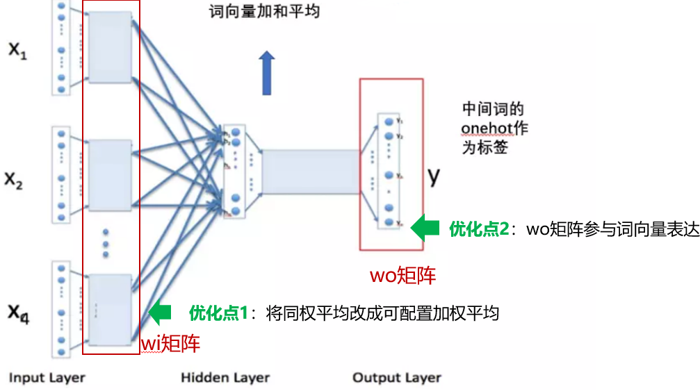
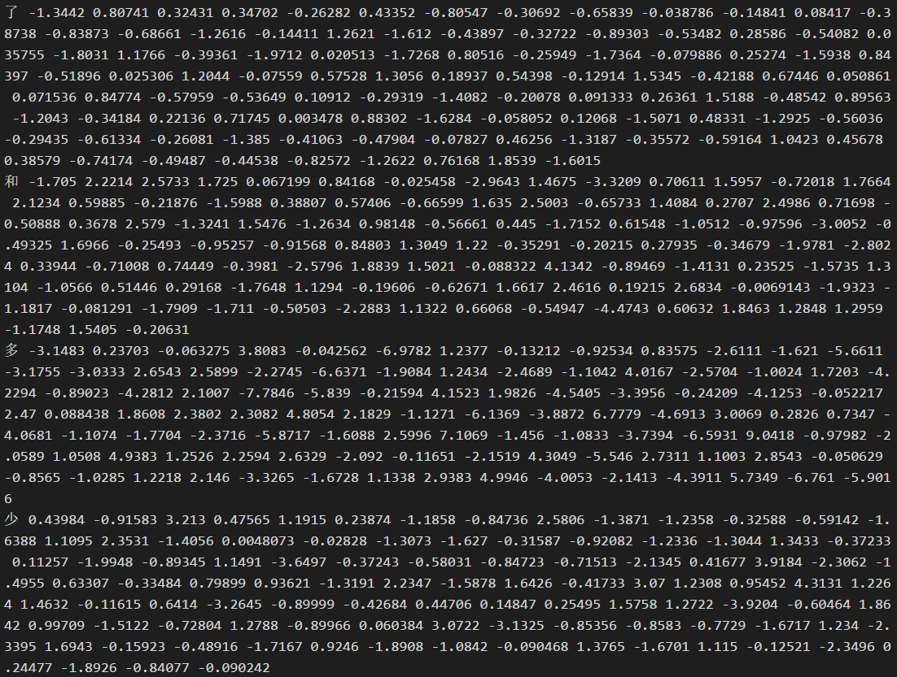

# fastText中文词向量训练调优
本工具基于最新版本fastText，针对于fastText训练中文词向量存在的一些问题，尝试训练输出一份更优质的中文词向量。

## 背景

fastText训练词向量的方式同其余词向量训练工具(如gensim)的最大区别在于引入了subword ngram embedding机制。该机制会将词拆解成subword学习其embedding，在英文场景下该方式可以学习如ing，en，sub等词根的语义，对于中文而言可以实现字向量建模。该方法不仅能够学习出更精细的词向量，还能有效应对未登录词(UNK)。该方式下，最终词向量除包含词本身的embedding外还加权了subword ngram embedding。

然而在引入subword ngram embedding的情况下，会出现词向量表达太过注重字面而非语义的情况，最终效果往往不如gensim等其他工具训练的词向量。这一点不少人都有提及[1]，比如’交易’的相似词汇gensim给出的是’买卖’，而fastText给出的是’交易法’。这里主要原因在于fastText最终的词向量采用了average-pooling融合word embedding和subword ngram embedding，无差别的avg-pool让字向量的权重过高。就拿"交易"这个词为例，FastText最终得到的词向量为：1/3*(w2v("交易")+c2v("交")+c2v("易"))，w2v("交易")只占了1/3的权重。

## 优化点

针对上述问题进行了两方面调优：


1 对fastText subword ngram embedding增加非均匀加权训练和融合方式

通过对训练阶段&梯度计算阶段&词向量计算阶段进行修改，以实现非均匀加权训练和融合方式，提升词向量部分的权重。此处注意仅仅修改词向量计算阶段的加权逻辑是不够的，还需要改写训练阶段&梯度计算阶段的avg-pool方式，改写梯度分配方式，同时整体权重需要在这三个阶段统一，这样才不会造成冲突导致不理想的结果。具体需要针对cbow和skipgram两种训练词向量的接口分别进行修改，主要修改逻辑在Fasttext和Model这两个模块中，同时为了做到可配置，还需要修改Args模块中部分逻辑。


2 融合fastText的wi,wo两个参数矩阵作为词向量的表达

该思路参考GloVe训练词向量的方法，这里简单介绍一下。GloVe基于矩阵分解的原理，可以参照下边的公式。公式(1)表达了词向量和共现矩阵之间的关系，Xij表示单词i出现在单词j的上下文中的次数,w和˜w是我们要求解的词向量，其中w表征词本身的向量，˜w是词作为context时的向量。公式(2)是GloVe训练词向量的loss function。可以看到公式(1)(2)本身对于w,˜w是对称的，两者均能够反映词语义。GloVe不对w和˜w使用同一套参数是为了在更新参数的时候能够简单套用SGD，但原论文经过试验发现将两个向量加权融合效果最好[2]。

 

同理如下图，fasttext训练词向量也有两套参数，wi,wo两个矩阵。wi矩阵是wordvec lookup embedding layer的参数，wo矩阵是词向量模型CBOW的softmax layer参数。由于训练词向量时label数量等同于词表数，所以wo也可以作为词向量的间接表达。

 

许多NLP任务中会将softmax层的参数同输入embedding共享权重以提升效果[3]，对于fasttext训练词向量的模型结构体现为wi wo共享一套参数。此处fastText不这么做的原因之一是出于灵活性考虑，由于fastText训练词向量可以选择使用层次softmax或negative sampling，并且fastText除了训练词向量还做文本分类任务。当进行文本分类任务或使用层次softmax时，wo均不能对应到word embedding上。因此fasttext只使用wi矩阵作为词向量的表达。

但目前negative sampling是更主流的方式，也是fasttext的默认选择。并且通过实际测试在此情况下，wo对于词义的表达效果优异，因此这里通过加权的方式将wi和wo融合起来作为最终的词向量表达。


综上，总结本工具的修改点：
1) 提供对wi的word embedding和char ngram embedding非均匀加权的能力。包括改写训练阶段的avg-pool为加权avg-pool，改写梯度分配，改写词向量计算的avg-pool。
2) 融合fastText的wi,wo两部分参数矩阵输出词向量 
3) 提供一个配套的测试方法和词向量输出方法，对比评估原版词向量和优化后词向量的nn结果，输出优化后的词向量文件。
4) 为了方便使用char ngram embedding，提供一个输出全量char embedding的方法。 


 

## 使用方法

安装方式同社区版fastText相同。解压工程后编译fasttext：

```
cd fastText-master
make
```


为了方便测试项目附带了一个数据集test_data.zip，首先通过命令：

```
unzip test_data.zip
```

解压后得到training_m.data，一个很小的中文问答数据集，我已经预先分词了可以直接作为fasttext的输入。


然后按推荐的参数训练，这里使用skipgram：

```
./fasttext skipgram -input training_m.data -output model_opt -minn 1 -maxn 1 -factor 5 -addWo 0.5
```

介绍一下这里额外添加的参数：

1） factor(default 0)，该参数表明对word emb的加权权重，factor=2表示word emb的加权权重是其余ngram emb的2倍。 factor越大，模型对word emb的训练权重也越大，ngram emb/char emb的权重越小。该参数控制了词向量在语义和字面匹配之间的权衡。

2） addWo(default 0)，该参数设置最终词向量使用wo矩阵的占比，默认0同社区版fasttext相同，即wo不参与最终词向量的计算。addWo=1时，wo矩阵无衰减参与最终词向量的表达。

<br>
<br>

为了对比使用默认参数训练一个模型作为对比：

```
./fasttext skipgram -input training_m.data -output model_raw -minn 1 -maxn 1
```

按此默认参数下得到的模型同社区版直接训练的结果是一致的。此处minn和maxn的参数都设置为1，即仅使用中文字向量，这适用于大部分中文词向量的训练，因为中文词不像英文单词由大量char构成，因此minn=maxn=1保证只使用1-gram 


## 效果对比评估

上边使用公开小语料集training_m.data训练了两个模型，一个是fasttext社区版的baseline模型model_raw.bin，另一个是优化后的版本model_opt.bin。

这里分别测试对比这两个模型：

```
./fasttext nn model_opt.bin
./fasttext nn model_raw.bin
```

结果如下：

```python
model_opt.bin的结果：
Query word? 饺子
蒜蓉 0.690226
切好 0.681618
醋 0.664326
辣椒粉 0.663786
豆皮 0.661796
葱姜 0.650897
青椒 0.650654
保鲜膜 0.650567
熬 0.650505
烧沸 0.645527

model_raw.bin的结果：
Query word? 饺子
柿子 0.892918
饺子皮 0.878708
筷子 0.871597
哨子 0.858302
裤子 0.849958
瓜子 0.842288
鸽子 0.842207
槽子 0.839584
钩子 0.836922
蚊子 0.834215

---------------------------------------------

model_opt.bin的结果：
Query word? 跑车
双门 0.724573
轿车 0.72284
敞篷车 0.721948
车标 0.717794
SUV 0.709904
敞篷 0.69593
四门 0.683056
车款 0.681556
加长版 0.674641
豪华轿车 0.670435

model_raw.bin的结果：
Query word? 跑车
跑车 0.946714
车内 0.848424
敞篷车 0.846979
驾车 0.832803
机车车辆 0.832658
飙车 0.831429
快车 0.830724
车迷 0.827681
辆车 0.827191
此车 0.826358
```

可以看出原版fasttext对于subword字向量的权重太高，导致kNN的结果中出现不少字面匹配的奇怪词汇。相比之下优化后的结果能够更好的捕捉语义上的相似。

```python
model_opt.bin的结果：
Query word? 设力电水
民用建筑 0.6186
模具设计 0.613224
工程施工 0.603733
电力设备 0.602683
给排水 0.589357
专用设备 0.589225
电力电缆 0.587747
仪器仪表 0.576457
建筑安装 0.572373
概预算 0.565508
```
对于一个混乱词汇” 设力电水”，fasttext依然能够给出词向量表达(如果使用gensim词向量，这种词汇会被标识为UNK无法给出embedding表达)，通过良好的捕捉字面量的语义，弥补了词向量表征的不足，达到了字向量和词向量相辅相成的良好效果。


## 其他功能

社区版fasttext提供了导出词向量的功能，但无法导出全量subwords embedding，而这是fasttext词向量的核心，因此增加一个导出功能，通过添加参数-saveSubwords。

```
./fasttext cbow -input training_m.data -output model_with_subwords -saveSubwords -minn 1 -maxn 1 -factor 10 -addWo 0.5
```

导出文件保存为：模型文件名+_subwords.vec。这里就是model_with_subwords_subwords.vec

这样就可以更灵活的使用和分析字向量：

 

顺便提一下这里使用了CBOW而不是skipgram，该模型需要的factor值会比skipgram更大一些，实测取8-12比较合适。


<br> 
<br> 

Ref:

[1] 如何评价Word2Vec作者提出的fastText算法 https://www.zhihu.com/question/48345431/answer/119566296

[2] Jeffrey Pennington, Richard Socher, and Christopher D. Manning. 2014. Glove: Global vectors for
word representation. In Empirical Methods in Natural Language Processing (EMNLP)

[3] Ofir Press and Lior Wolf. Using the output embedding to improve language models. arXiv preprint arXiv:1608.05859, 2016

<br> 
<br>   
<br>
<br> 
<br>   
<br>

***

<br>
    
更多用法和文档请参照fasttext社区版：https://github.com/facebookresearch/fastText
